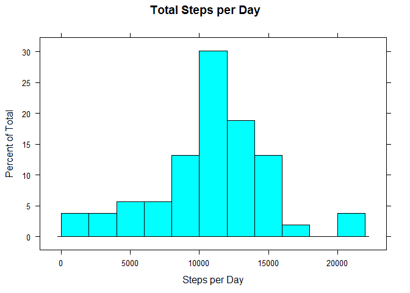
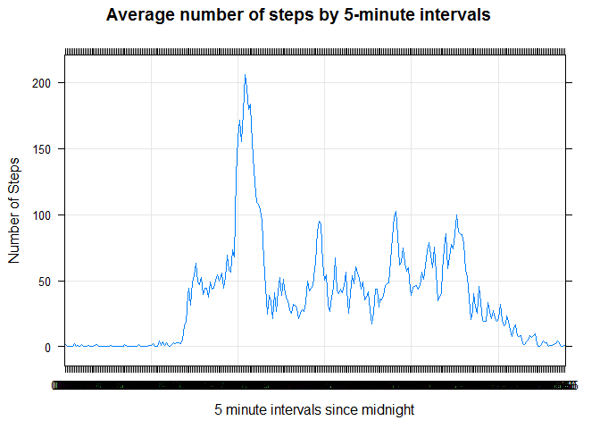
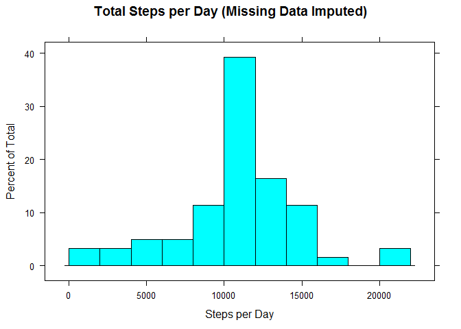
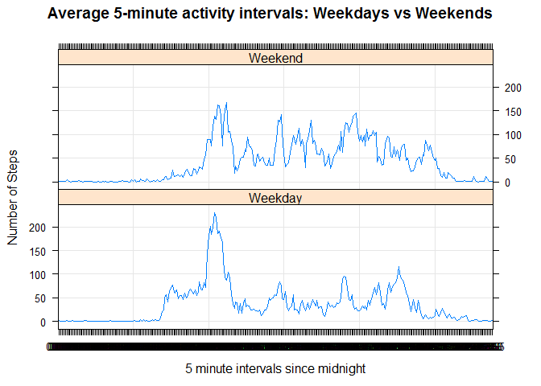

# Reproducible Research: Peer Assessment 1


## Loading and preprocessing the data
1. Load in data
a. baseDir will be use as the prefix for the working directory.

```r
baseDir <- "."
```

b. Create data sub-directory if it does not already exist.

```r
dataDir <- file.path(baseDir, "data")
if(!file.exists(dataDir)) { dir.create(dataDir) }
```

c. Create file paths for zip file and date file.

```r
zipFilePath <- file.path(dataDir, "activity.zip")
dateFilePath <- file.path(dataDir, "date_time_downloaded.txt")
```

d. Download original data if necessary but skip this step if it already exists.

```r
if(!file.exists(zipFilePath)) { 
    zipFileUrl <- "https://d396qusza40orc.cloudfront.net/repdata%2Fdata%2Factivity.zip"
    download.file (zipFileUrl, zipFilePath)
    DTDownloaded <- format(Sys.time(), "%Y-%b-%d %H:%M:%S")
    cat (DTDownloaded, file=dateFilePath)
} else {
    DTDownloaded <- scan(file=dateFilePath, what="character", sep="\n")
}
```

e. Create file path for unzipped file.

```r
filePath <- file.path(dataDir, "activity.csv")
```

f. Unzip file if it has not already been unzipped.

```r
if(!file.exists(filePath)) { 
    unzip (zipFilePath, exdir=dataDir)
}
```

g. Read dataset and load into R.

```r
dataset <- read.csv(filePath, header = TRUE) 
```

h. Create statement stating where data is located and when it was downloaded.

```r
cat ("The dataset is located at", filePath, "and was downloaded on", DTDownloaded)
```

```
## The dataset is located at ./data/activity.csv and was downloaded on 2017-Feb-04 16:40:16
```

i. Look at the dataset structure.

```r
str(dataset)
```

```
## 'data.frame':	17568 obs. of  3 variables:
##  $ steps   : int  NA NA NA NA NA NA NA NA NA NA ...
##  $ date    : Factor w/ 61 levels "2012-10-01","2012-10-02",..: 1 1 1 1 1 1 1 1 1 1 ...
##  $ interval: int  0 5 10 15 20 25 30 35 40 45 ...
```

The variables included in this dataset are: 
. steps: Number of steps taking in a 5-minute interval (missing values are coded as  NA ) 
. date: The date on which the measurement was taken in YYYY-MM-DD format 
. interval: Identifier for the 5-minute interval in which measurement was taken 

2. Preprocess the data

a. The date field needs to be converted to a date instead of a factor with 61 levels.

```r
dataset$date <- as.Date(dataset$date)
```

b. Intervals are stored as a number in the form of hhmm where hh=hours and mm= minutes. Create new fields for minute, hour, and elapsed.

```r
dataset$minute <- dataset$interval %% 100
dataset$hour <- dataset$interval %/% 100
dataset$elapsed <- dataset$hour * 60 + dataset$minute
```

c. Create new field for time since midnight.

```r
dataset$sInterval <- as.factor(sprintf("%02d:%02d", dataset$hour, dataset$minute))
```

d. Divide original interval field by 100 to have a better visualization.

```r
dataset$interval <- dataset$interval / 100
```

e. View structure of processed dataset.

```r
str(dataset)
```

```
## 'data.frame':	17568 obs. of  7 variables:
##  $ steps    : int  NA NA NA NA NA NA NA NA NA NA ...
##  $ date     : Date, format: "2012-10-01" "2012-10-01" ...
##  $ interval : num  0 0.05 0.1 0.15 0.2 0.25 0.3 0.35 0.4 0.45 ...
##  $ minute   : num  0 5 10 15 20 25 30 35 40 45 ...
##  $ hour     : num  0 0 0 0 0 0 0 0 0 0 ...
##  $ elapsed  : num  0 5 10 15 20 25 30 35 40 45 ...
##  $ sInterval: Factor w/ 288 levels "00:00","00:05",..: 1 2 3 4 5 6 7 8 9 10 ...
```

f. Sum the number of steps for each day and average the number of steps for each interval. This can be done using the aggregate function with the sum and mean.

```r
sumStepsPerDay <- aggregate(steps ~ date, data=dataset, FUN="sum", na.exclude=T)
meanStepsPerInterval <- aggregate(steps ~ sInterval, data=dataset, FUN="mean", na.exclude=T)
```

## What is mean total number of steps taken per day?

1. Make a histogram of the total number of steps taken each day.

```r
library(lattice)
histogram(sumStepsPerDay$steps,breaks=10,main="Total Steps per Day", xlab="Steps per Day")
```

<!-- -->

2. Calculate and report the mean and median of the total number of steps taken per day.

```r
mean1<-mean(sumStepsPerDay$steps,na.rm=T)
mean1
```

```
## [1] 10767.19
```

```r
median1<-median(sumStepsPerDay$steps, na.rm=T)
median1
```

```
## [1] 10766
```

## What is the average daily activity pattern?

1. Make a time series plot (i.e. type = "l") of the 5-minute interval (x-axis) and the average number of steps taken, averaged across all days (y-axis).

```r
xyplot(steps~sInterval,data=meanStepsPerInterval, type = "l", grid= T, ylab="Number of Steps", xlab="5 minute intervals since midnight", main="Average number of steps by 5-minute intervals")
```

<!-- -->

2. Which 5-minute interval, on average across all the days in the dataset, contains the maximum number of steps?

```r
MaxInterval <- meanStepsPerInterval$sInterval[which.max(meanStepsPerInterval$steps)]
MaxInterval
```

```
## [1] 08:35
## 288 Levels: 00:00 00:05 00:10 00:15 00:20 00:25 00:30 00:35 00:40 ... 23:55
```

## Imputing missing values

Note that there are a number of days/intervals where there are missing values (coded as NA). The presence of missing days may introduce bias into some calculations or summaries of the data.

1. Calculate and report the total number of missing values in the dataset (i.e. the total number of rows with NAs).

```r
MissingSteps<-sum(is.na(dataset$steps))
MissingSteps
```

```
## [1] 2304
```

```r
MissingDate<-sum(is.na(dataset$date))
MissingDate
```

```
## [1] 0
```

```r
MissingInterval<-sum(is.na(dataset$interval))
MissingInterval
```

```
## [1] 0
```

2. Devise a strategy for filling in all of the missing values in the dataset. The strategy does not need to be sophisticated. For example, you could use the mean/median for that day, or the mean for that 5-minute interval, etc.

This analysis uses average steps per interval over all days to replace the missing value for each day and period.This is included in the meanStepsPerInterval dataframe as shown below:


```r
str(meanStepsPerInterval)
```

```
## 'data.frame':	288 obs. of  2 variables:
##  $ sInterval: Factor w/ 288 levels "00:00","00:05",..: 1 2 3 4 5 6 7 8 9 10 ...
##  $ steps    : num  1.717 0.3396 0.1321 0.1509 0.0755 ...
```

3. Create a new dataset that is equal to the original dataset but with the missing data filled in.

a. First copy the dataset to a new dataframe called newDataset. Create a subset of the missing values and replace them with the mean for each period from meanStepsPerInterval.

```r
newDataset<-dataset
for(r in 1:nrow(newDataset)){
    if(is.na(newDataset$steps[r])) {
        replace<-meanStepsPerInterval$steps[meanStepsPerInterval$sInterval==newDataset$sInterval[r]];
        newDataset$steps[r]<-replace;
    }
}
```

b. Check new dataset to ensure that all the NAs were replaced.

```r
str(newDataset$steps)
```

```
##  num [1:17568] 1.717 0.3396 0.1321 0.1509 0.0755 ...
```

```r
MissingStepsNew<-sum(is.na(newDataset$steps))
MissingStepsNew
```

```
## [1] 0
```

4. Make a histogram of the total number of steps taken each day and Calculate and report the mean and median total number of steps taken per day. Do these values differ from the estimates from the first part of the assignment? What is the impact of imputing missing data on the estimates of the total daily number of steps?

a. Make the histogram of total number of steps taken each day.

```r
library(lattice)
sumStepsPerDay2 <- aggregate(steps ~ date, data=newDataset, FUN="sum")
histogram(sumStepsPerDay2$steps,breaks=10,main="Total Steps per Day (Missing Data Imputed)", xlab="Steps per Day")
```

<!-- -->

b. Calculate the mean and median total number of steps taken per day.
The mean and median for the new dataset are calculated and then compared to the mean and median of the original dataset.

```r
mean2<-mean(sumStepsPerDay2$steps)
mean2
```

```
## [1] 10766.19
```

```r
meanDif<-mean2-mean1
meanDif
```

```
## [1] -1
```

```r
median2<-median(sumStepsPerDay2$steps)
median2
```

```
## [1] 10766.19
```

```r
medianDif<-median2-median1
medianDif
```

```
## [1] 0.1886792
```


```r
cat ("The new mean and median are almost the same as the original dataset as shown above. The mean is", meanDif, "lower than the original dataset and the median is", medianDif, "higher than the original dataset.")
```

```
## The new mean and median are almost the same as the original dataset as shown above. The mean is -1 lower than the original dataset and the median is 0.1886792 higher than the original dataset.
```

c. What is the impact of imputing missing data on the estimates of the total daily number of steps?  
Looking at the histogram, the percent of steps near the mean increased from about 30% to 40%. To determine the magnitude, the difference between the standard deviation in the total daily number of steps of the original and new dataset is calculated.


```r
StDev1<-sd(sumStepsPerDay$steps)
StDev1
```

```
## [1] 4269.18
```

```r
StDev2<-sd(sumStepsPerDay2$steps)
StDev2
```

```
## [1] 3974.391
```

```r
StDevDif<-StDev2-StDev1
```


```r
cat ("The standard deviation from the new dataset is", StDevDif, "lower than the original dataset.")
```

```
## The standard deviation from the new dataset is -294.7897 lower than the original dataset.
```

## Are there differences in activity patterns between weekdays and weekends?

1.Create a new factor variable in the dataset with two levels - "weekday" and "weekend" indicating whether a given date is a weekday or weekend day.

a. First create a new field for Day of the week using the weekdays function.

```r
newDataset$day<-weekdays(newDataset$date, abbreviate=T)
```

b. Second, create a new field for weekday or weekend and make them all default to weekday.

```r
newDataset$Weekday<-"Weekday"
```

c. Rename the subset that fall on Sat or Sun to Weekend.

```r
newDataset$Weekday[newDataset$day %in% c("Sat","Sun")]<-"Weekend"
```

2.Make a panel plot containing a time series plot (i.e. type = "l") of the 5-minute interval (x-axis) and the average number of steps taken, averaged across all weekday days or weekend days (y-axis). 

a. Calculate mean steps per interval for new dataset.

```r
meanStepsPerInterval2 <- aggregate(steps ~ sInterval+Weekday, data=newDataset, FUN="mean")
```

b. Create the plot.

```r
xyplot(steps~sInterval | Weekday,data=meanStepsPerInterval2, type = "l", grid= T, layout=c(1,2), ylab="Number of Steps", xlab="5 minute intervals since midnight", main="Average 5-minute activity intervals: Weekdays vs Weekends")
```

<!-- -->

This plot shows that steps are more evenly spread throughout the day on weekends. On weekdays, steps are more concentrated in the morning and evening.
